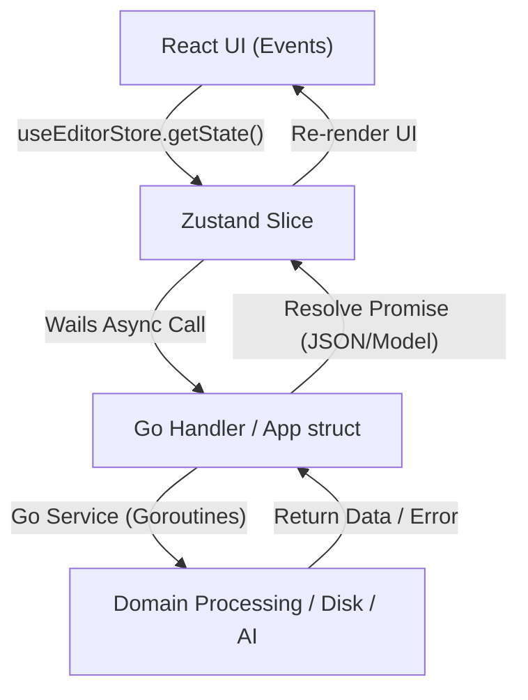

# 🗺️ خريطة ومعمارية Grido Studio (Architecture Navigator)

استخدم هذه المهارة لفهم تدفق البيانات، مواقع المكونات، والعلاقة بين Go Backend و React Frontend بلمحة واحدة.

---

## 🏗️ 1. الهيكل العام ودليل الملفات (Directory Layout)

### 🔹 Go Backend (`/internal` & `/main.go`)
- **[main.go](file:///c:/projects/grido/main.go):** مدخل التطبيق وتثبيت الـ Assets و Mime Types و Wails Runtime Options.
- **[app.go](file:///c:/projects/grido/app.go):** الواجهة الرئيسية الرابطة بين Wails والخدمات (App struct).
- **`internal/core/domain/`**: الهياكل الأساسية والأنواع (Domain Models):
  - [print.go](file:///c:/projects/grido/internal/core/domain/print.go): `PrintRequest`, `PrintItem`, `CutLine`, `PrintResult`.
  - [user.go](file:///c:/projects/grido/internal/core/domain/user.go): `UserProfile`, `LicenseInfo`.
  - [project.go](file:///c:/projects/grido/internal/core/domain/project.go): `ProjectData`, `CanvasElement`.
- **`internal/service/`**: خدمات المنطق والعمليات الخلفية (Services):
  - [print_service.go](file:///c:/projects/grido/internal/service/print_service.go): رسم الكولاج، التحويل إلى CMYK، التصدير لـ TIFF/PNG، وإدارة طباعة HTML.
  - [media_service.go](file:///c:/projects/grido/internal/service/media_service.go): استخراج أبعاد الصور `GetImageDimensions` والـ Local Image Handler.
  - [license_service.go](file:///c:/projects/grido/internal/service/license_service.go): الاتصال بـ Supabase (دخول البريد، OTP، Google OAuth، تفعيل الترخيص).
  - [ai_service.go](file:///c:/projects/grido/internal/service/ai_service.go): إزالة الخلفية وترميم الوجوه عبر Modal AI الخارجي أو MediaPipe المحلي.
  - [autosave_service.go](file:///c:/projects/grido/internal/service/autosave_service.go): الحفظ الذري الدوري لملفات المشاريع على القرص (`f.Sync()` + `os.Rename`).
- **`internal/repository/`**: حفظ البيانات المحلية في ملفات ومربعات SQLite / JSON.
- **`internal/utils/`**: الأدوات المساعدة: `GetAppDir()`, `OpenBrowser()`, `GetDeviceID()`.

---

### 🔹 React Frontend (`/frontend/src`)
- **`src/lib/`**: المكتبات والخدمات المنطقية المنظمة حسب الاختصاص:
  - **`store/`**: إدارة الحالة المركزية عبر Zustand (`useEditorStore`):
    - [editor-store.ts](file:///c:/projects/grido/frontend/src/lib/store/editor-store.ts): المتجر الرئيسي التجميعي للـ Slices.
    - `slices/core-slice.ts`: الأبعاد، العناصر، النمط (`mode`: `single` | `collage`), الألوان، الحفظ والتحميل.
    - `slices/history-slice.ts`: التراجع والإعادة (Undo/Redo) بنسخ سطحي محفّز.
    - `slices/license-slice.ts`: مصادقة المستخدم، التراخيص، والدخول عبر جوجل.
    - `slices/ui-slice.ts`: النوافذ المنبثقة، التكبير (Zoom)، المساطر، والحوارات.
  - **`print/`**: محركات الطباعة والقص (`print-layout-math.ts`, `cut-lines-utils.ts`, `single-print-composition.ts`).
  - **`canvas/`**: هندسة الكانفاس والمحاذاة والتصدير (`snap-utils.ts`, `stage-context.tsx`, `render-quality.ts`, `konva-export-utils.ts`).
  - **`filters/`**: فلاتر الصور وتأطير الوجوه الذكي (`custom-filters.ts`, `konva-filters.ts`, `face-frame-utils.ts`).
  - **`io/`**: خدمات الملفات والحافظة والخطوط والمشاريع (`file-dialog-utils.ts`, `clipboard-utils.ts`, `project-serializer.ts`, `fonts.ts`).
  - **`templates/`**: قوالب الهوية والكولاج وشبكات الطباعة القياسية.
- **`src/components/editor/`**: مكونات المحرر المنظمة هرمياً:
  - **`dialogs/`**: النوافذ المنبثقة (`print-dialog.tsx`, `export-dialog.tsx`, `crop-dialog.tsx`, `refine-bg-dialog.tsx`, `projects-dialog.tsx`, `account-license-modal.tsx`, `keyboard-shortcuts-dialog.tsx`).
  - **`panels/`**: الألواح الجانبية وبطاقات القوالب (`template-panel.tsx`, `properties-panel.tsx`, `layers-panel.tsx`, `collage-template-card.tsx`, `custom-collage-card.tsx`, `photo-type-miniature.tsx`).
  - **`toolbar/`**: شريط الأدوات وعمليات الملفات (`toolbar.tsx`, `toolbar-items.tsx`, `toolbar-file-ops.tsx`).
  - **`system/`**: خدمات النظام ونوافذ ويندوز (`update-notifier.tsx`, `window-resize-handles.tsx`).
  - **`canvas/`**: مساحة العمل والكانفاس (`editor-canvas.tsx`, `context-menu.tsx`, `canvas-rulers.tsx`, `canvas-quick-bar.tsx`, `text-editing-overlay.tsx`).
  - **`properties/`**: لوحات التحكم بالخصائص والألوان والتأثيرات (`element-properties.tsx`, `slot-properties.tsx`, `collage-settings.tsx`, `gradient-picker.tsx`, `shared-controls.tsx`).
  - **`konva/`**: محرك الرسم بـ Konva (`konva-canvas.tsx`, `konva-grid.tsx`, عقد العناصر `elements/`).
- **`wailsjs/go/`**: الواجهات المولدة تلقائياً بواسطة Wails للتواصل بين JS ↔ Go (`main/App` و `models.ts`).

---

## 🔄 2. تدفق البيانات والجسر التفاعلي (IPC Bridge Flow)

### 💡 قواعد استدعاءات Wails الذهبية:
1. **استبقاء الأخطاء:** Wails يرجع الأخطاء كـ `string`. استخدم دائماً:
   `typeof err === "string" ? err : (err instanceof Error ? err.message : fallback)`
2. **منع Stale Closures:** داخل معالجات الأحداث غير المتزامنة (مثل `handleDrop`) استخدم دائماً `useEditorStore.getState()` لقراءة أحدث حالة مباشرة لحظة وقوع الحدث.

---

## 📁 3. بيئة الملفات والمجلدات الخاصة بالبرنامج (AppData & Temp)
- **مجلد البيانات الرئيسي:** يُجلب عبر `utils.GetAppDir()` (`%APPDATA%\GridoStudio` في الويندوز، أو `GRIDO_APP_DIR` للاختبارات).
- **التصديرات المؤقتة:** `GetAppDir()/Exports/` (تُنظف تلقائياً للملفات الأقدم من 24 ساعة).
- **الحفظ التلقائي:** `GetAppDir()/AutoSave/project_autosave.json`.
- **المعاينات المحلية:** الصور تُعرض في المتصفح عبر المسار المأمون `/local-image/<filename>` المفحوص ضد ثغرة Symlink & Path Traversal.
