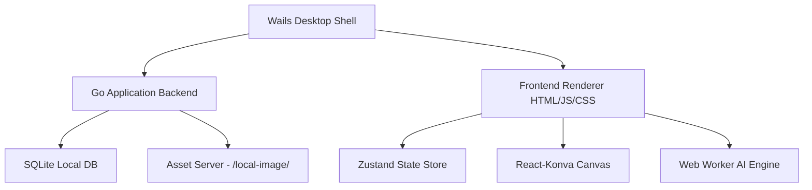
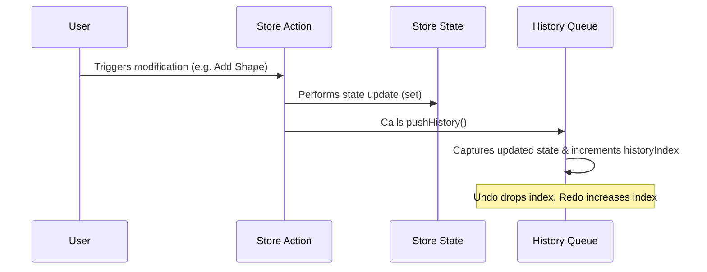

# Grido Studio - Developer Guide & Architecture Documentation

Welcome to the **Grido Studio** developer guide. This document provides an in-depth explanation of the application's architecture, key systems, canvas engine, state management, background processes, testing workflows, and build guides.

---

## 1. Architectural Overview

Grido Studio is built as a hybrid desktop application utilizing **Wails v2** (Go backend) and **React + TypeScript** (Frontend).



### Backend (Go)
- **Framework:** [Wails v2](https://wails.io/) binds Go methods to JavaScript automatically.
- **Wails App Lifecycle:** Defined in `app.go` (`App` struct). Key hooks include `startup` (initializes context) and `shutdown`.
- **Database Repository:** SQLite is handled under `internal/repository/db.go`. It manages project serialization, saving, and loading.
- **Media Directory:** Local files are written to a user-specific AppData directory (accessible via `getMediaDir()`).
- **Custom Asset Handler:** Configured in `main.go` to serve local files. Wails maps the route `/local-image/*` directly to local files saved on disk in the application directory.

### Frontend (TypeScript + React)
- **Framework:** Vite-powered React with TypeScript.
- **Styling:** Vanilla CSS tailored with utility-first tailwindcss-like styling variables.
- **Canvas Engine:** `react-konva` wraps the standard Konva HTML5 2D Canvas library.
- **State Management:** Zustand managing canvas nodes, editor modes, printing configurations, and history.

---

## 2. Canvas Engine & Geometry

The editor operates in two modes: **Collage Mode** (fixed slot layouts) and **Single/Design Mode** (free-form layer-based canvas).

### Coordinate System (Normalized Percentages)
To support responsive canvas resizing without losing element proportions, Grido stores all dimensions and positions in **normalized percentages** (values between `0.0` and `1.0` relative to the A4 workspace boundaries):

$$\text{Pixel Position} = \text{Normalized Coordinate} \times \text{Canvas Dimension}$$

- **State Storage:** `x`, `y`, `width`, `height` are stored as fractions (e.g. `x: 0.35` on a `1200px` canvas is `420px`).
- **Rendering:** Values are converted dynamically to pixels when rendered inside `konva-elements.tsx`:
  ```tsx
  x={element.x * displayW}
  y={element.y * displayH}
  ```
- **Updates:** Drag/transform handlers divide pixel outputs back by canvas dimensions to update the store:
  ```typescript
  onChange({
    x: node.x() / displayW,
    y: node.y() / displayH,
  });
  ```

### Bounding Boxes & Offsets
- **Transformer:** Konva's `<Transformer>` anchors are customized to match Figma: circular purple anchors (`anchorSize: 10`, `anchorFill: "#4f46e5"`), locked aspect ratios, and padding.
- **Star & Circle Origin Offsets:** Primitives (like Circles and Stars) are rendered using offsets (`offsetX = -width/2` and `offsetY = -height/2`) to align their Konva origin directly with the bounding box corners.
- **Snap Guides:** Interactive smart-alignment lines are generated dynamically using alignment math (in `lib/snap-utils.ts`) when objects are dragged close to other elements.

---

## 3. Zustand Editor Store & History Stack

The global store is defined in `frontend/src/lib/editor-store.ts`.

### State History Queue (Undo & Redo)
Grido manages a history queue of states to allow stepping backwards and forwards:



- **History Pushes:** To prevent breaking the Redo chain, store mutating actions (`addTextElement`, `duplicateElement`, `removeElement`, etc.) apply the state update **first**, and then call `pushHistory()` immediately.
- **Property Change Throttling:**
  - **Color Pickers:** Call `pushHistory()` only when the picker popover closes (`onOpenChange(false)`).
  - **Text & Number Inputs:** Call `pushHistory()` `onBlur` once the user finishes typing.
  - **Interactive Dragging:** Calls `pushHistory()` `onDragEnd` / `onTransformEnd`.

---

## 4. AI Background Removal Engine

Background removal is powered by **`selfie_multiclass.tflite`** running entirely on the client side inside a Web Worker.

- **Technology Stack:** `@mediapipe/tasks-vision` (`ImageSegmenter` with GPU delegate) — model is served locally from `frontend/public/models/`.
- **Background Worker (`workers/bg-removal.worker.ts`):** The full pipeline (model loading, image decode, resize to 1024px max, inference, mask bytes generation) runs off the main thread to keep the UI responsive.
- **Real Cancellation:** Cancel = hard `terminate()` of the Worker from the host (`use-bg-removal.ts`), aborting inference instantly; a fresh Worker is spawned per operation.
- **Blob-to-Base64 Offloading:** Converting the mask bytes to a `base64` string is performed **inside the Web Worker** using a chunked array buffer loop. The base64 data is then sent to Wails, bypassing the slow synchronous `FileReader` blocking on the main UI thread.

---

## 5. Build, Run, & Test

### Local Development
To run the application locally with hot-reloading enabled for both frontend and backend:
```bash
wails dev
```

### Running Tests
To verify all application layers compile and operate successfully:

#### 1. Backend Tests (Go)
Checks SQLite queries, backup logs, and project services.
```bash
go test ./...
```

#### 2. Frontend Unit Tests (Vitest)
Checks Zustand store initial values, mutations, and Undo/Redo logic.
```bash
npm run test
```

#### 3. E2E & Visual Regression Tests (Playwright)
Executes end-to-end user flows in a headless browser env.
```bash
npm run test:e2e
```

### Production Build
To build the optimized production desktop binary:
```bash
wails build
```
The compiled executable will be placed in the `build/bin/` folder.
