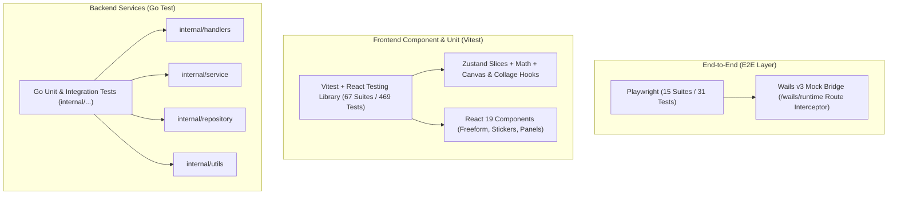

# Grido Studio Testing Guide 🧪

دليل شامل ومفصل لنظام الاختبارات المتكامل في **Grido Studio**، يغطي طبقات الهرم الاختباري الثلاث (Backend Go، Frontend Vitest، و Playwright E2E مع Wails v3 Mock Bridge)، وطرق تشغيلها وصيانتها وإضافة حالات اختبار جديدة.

---

## 1. المعمارية العامة لنظام الاختبارات

تم تصميم نظام الاختبارات ليعكس بنية التطبيق الهجينة (Go Backend + React 19 Frontend + Wails v3 Desktop Runtime):



---

## 2. معمارية جسر المحاكاة Wails v3 Mock Bridge

### 2.1 كيف يعمل اتصال Wails v3 في المتصفح؟
عند تشغيل التطبيق في بيئة متصفح (Web Browser / Playwright Headless)، لا يتوفر محرك WebView2 الأصلي لسطح المكتب. يقوم موديول `@wailsio/runtime` بإرسال طلبات POST إلى:
`POST /wails/runtime`

الحمولة المشفرة تكون بالشكل:
```json
{
  "object": 0,
  "method": 0,
  "args": {
    "call-id": "wails-call-12345",
    "methodID": 2229562725,
    "args": []
  }
}
```

### 2.2 دور `frontend/e2e/helpers/wails-v3-bridge.ts`
1. **اعتراض طلبات HTTP:** يقوم باعتراض مسار `**/wails/runtime` عبر `page.route()`.
2. **فك تشفير الـ Method ID:** يطابق الرقم البرمجي للطريقة ويستجيب بنتيجة JSON فورية.
3. **تفعيل ترخيص Pro فوري:** اعتراض الطريقة `2229562725` (`GetLicenseStatus`) وإرجاع كائن ترخيص مفعّل برقم تجاري دائم، مما يمنع تجمد الاختبارات في شاشة "النسخة مقفلة".
4. **محاكاة مزود الصور المحلي:** اعتراض `**/local-image/**` وتزويد المتصفح بصور شفافة 1×1 بكسل بصيغة PNG صالحة لمنع أعطال CORS و 404.
5. **حقن التوافقية لـ `window.go`:** حقن دوال وهمية ذكية في الـ Global Window لتلبية متطلبات المخازن القديمة إن وجدت.

### 2.3 كيفية إضافة مسار أو دالة Wails Backend جديدة للـ Mock Bridge
عند إضافة دالة Go جديدة في `internal/handlers` وتوليد روابط Wails bindings:
1. افتح ملف الربط المولد في `frontend/bindings/grido/...` لمعرفة `methodID` الخاص بالدالة.
2. افتح `frontend/e2e/helpers/wails-v3-bridge.ts`.
3. أضف الـ Method ID إلى خريطة المعالجات `WAILS_V3_METHOD_MAP`:
```typescript
case 1234567890: // اسم الدالة الجديدة
  return { success: true, data: "Mocked response" };
```

---

## 3. أوامر تشغيل الاختبارات السريعة

### 3.1 عبر Taskfile (الموصى به للمشروع كاملاً)

| الأمر | الوصف | الطبقة المستهدفة |
| :--- | :--- | :--- |
| `task test:all` | تشغيل كافة اختبارات الباكيند والفرونت إند و E2E كاملة | المشروع بالكامل |
| `task test:backend` | تشغيل كافة اختبارات الـ Go backend مع تفاصيل الحزم | Backend (`internal/...`) |
| `task test:frontend` | تشغيل كافة اختبارات Vitest للفرونت إند (67 ملف اختبار) | Frontend Unit/Component |
| `task test:e2e` | تشغيل اختبارات Playwright E2E السريعة على Chromium | E2E Browser |

### 3.2 عبر npm في مجلد `frontend`

```bash
cd frontend

# تشغيل فحص الأنواع الصارم والتنسيق ثم كل اختبارات Vitest واختبارات E2E
npm run test:all

# تشغيل اختبارات Vitest فقط (سريعة - ثوانٍ معدودة)
npm run test

# تشغيل اختبارات Vitest في وضع المراقبة التفاعلي أثناء التطوير
npm run test:watch

# تشغيل اختبارات Playwright السريعة (Chromium Headless)
npm run test:e2e:fast

# تشغيل Playwright مع الواجهة الرسومية التفاعلية والتنقيح البصري
npm run test:e2e:ui
```

### 3.3 عبر Go CLI في مجلد المشروع الرئيسي

```bash
# تشغيل جميع اختبارات الباكيند متجاوزاً الكاش
go test -count=1 -v ./internal/...
```

---

## 4. إرشادات كتابة الاختبارات (Best Practices)

### 4.1 اختبارات مكونات React (Vitest + RTL)
- **مزوّد التلميحات الموحد:** يجب دائماً تغليف المكونات بـ `<TooltipProvider>` لتجنب أخطاء Radix Tooltip السياقية.
- **تسميات Fluent 2 وأدوار الوصولية (ARIA):**
  - الكبسولات وشارات التصفية (`FluentFilterChips`) تمتلك دور `role="tab"`.
  - الأزرار المستقلة تمتلك دور `role="button"`.
- **المدخلات ذات التهدئة المؤقتة (Debounced Inputs):** عند اختبار حقول البحث التي تستخدم `setTimeout` لتقليل الضغط (مثل تأخير 120ms في `StickerCatalog`)، يجب إجبارياً تغليف التوقع بـ `await waitFor(() => expect(...).toHaveBeenCalledWith(...))` أو استخدام مؤقتات Vitest الوهمية (`vi.advanceTimersByTime`).

### 4.2 اختبارات الـ E2E بـ Playwright
- **تجهيز التطبيق الأولي:** استخدم دائماً المساعد القياسي:
  ```typescript
  import { setupWailsV3Mock, waitForAppReady } from './helpers/wails-v3-bridge';

  test.beforeEach(async ({ page }) => {
    await setupWailsV3Mock(page);
    await page.goto('/');
    await waitForAppReady(page);
  });
  ```
- **تجنب تضارب التحديد الصارم (Playwright Strict Mode):** عند استخدام `.or()`، احرص على استخدام `.first()` في حال تطابق عنصرين لتفادي خطأ `strict mode violation`.
- **معالجة النوافذ المنبثقة (Radix Overlays):** نظراً لأن خلفيات الأكريليك (`fluent-smoke-backdrop`) قد تعترض نقرات الفأرة، يُفضل إغلاق النوافذ عبر `page.keyboard.press('Escape')` وهو السلوك القياسي لـ Fluent 2.

---

## 5. حالة التغطية الحالية (Baseline Metrics)

- **Go Backend:** كافة الحزم في `internal/handlers` و `internal/service` و `internal/repository` و `internal/utils` تجتاز الاختبارات بنسبة 100% (صفر أخطاء).
- **Vitest Frontend:** **67 ملف اختبار** يضم **469 حالة اختبار** تجتاز بنجاح تام 100%.
- **Playwright E2E:** **15 ملف مواصفة** يضم **34 سيناريو تفاعلي متكامل** تجتاز بنجاح تام على بيئة Wails v3 Mock Bridge في GitHub Actions، متضمنةً اختبارات كفاءة الكانفاس وسرعة السحب بمعدل **59.9 إطار في الثانية**.
- **GitHub Step Summaries:** يقوم خط الأنابيب بتوليد لوحات إحصائية وتلخيصات بصرية تلقائية لجميع مهام البناء والاختبار في واجهة GitHub Actions لكل عملية دمج أو دفع جديدة.
